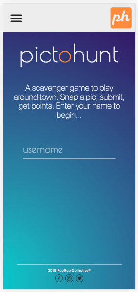

# picto_hunt
A fun and interactive mobile app game that utilizes Google Vision API, a PostGresSQL database, and a camera phone. A user is assigned a item to find, and if the item they take a picture of matches that assignment, the user gains points.  



### Designed and Built by the Rooftop Collective
Peter Carmicheal, James Dansie, Julie Erlemeier, Sharina Stubbs.

### Demo of App 
In September 2019, PictoHunt was built and demoed by the Rooftop Collective to an audience. Here is a recording of the short demo during the presentation:
[![Screen capture recording of live demo of app] (https://img.youtube.com/vi/-0ZAuaZsf5nQ/0.jpg)](https://www.youtube.com/watch?v=-0ZAuaZsf5nQ)


### A Code Fellows 301-Intermediate Software Development Project.
Teaching Staff: Nicholar Carignan (Lead Instructor), Lena Eivy (Assistant Instructor), Dan Le (Teaching Assistant).

### Dependencies
dotenv, ejs, express, method-override, pg, superagent, google-cloud/vision, and multer.

### Database table
```
DROP TABLE IF EXISTS scores;
CREATE TABLE scores(
 id SERIAL PRIMARY KEY,
 username VARCHAR(255),
 score BIGINT
);
```

### Daily Schedule
8/29/19, Peter
* Spike: Confirming functionality of camera use - saving newly taken pic from mobile phone to server on computer.

8/30/19, All
* Shared spike with group, then showed Nick: Approved.
* Created Trello Board, separated tasks into backend and frontend.

8/30/19, All
* Discussed topics
* Wireframes
* User Stories
* Server up and running

9/3/19, All
* Basic integration to Google Vision API, so that console output shows labels that correlate to the photo taken
* Styling and EJS started
* File Tree completed 
* Camera functionality 
* Logic for comparison of photos to item to find established and working

9/4/19, All
* Styling, including that for results page and nav bar.
* Google API key issues regarding .env file formatting dealt with.
* Front end gained access to results from photo analysis sent through Google Vision API. 
* Significant work on asynchronous events in the backend. 
* Database basic functionality achieved, with usernames added to database. 

9/5/19, All
* Dealt with an issue of duplication of usernames in database
* Achieved success with updating scores in the database and sending score and high scores over to front end
* Fixed layout issues with all pages and improved usability for the user.
* Randomizer of items to find and logic regarding points achieved.
* Attempted to redeploy to Heroku with help of Cloudinary to store images, but without success.

### Roles and Individual Goals
Julie: PM and Head of Functionality
James : polish piece for portfolio, head API integration.
Sharina: Creating something functional and usable, use project week to pull together CTO
Peter: Master of Breaks, CSS, Head of design: modern and gorgeous, from scratch, paralax(different scroll speeds, animation. Want to give everyone a url so they can follow along in the audience. 

James/Sharina: Back-end development
Peter: Front-end development
Julie: Mediated communication between front and back end teams, and contributed to both front-end and back-end development.

### Communication Plan
Communication Formats After Hours and On Weekend:
Slack
Trello for file sharing, To Do lists

#### Communication in the code:
* Go way overkill on the comments.
* Group Working Hours
    9am – 6pm group time.
    8am- 9:15pm be aware group member(s) may need to communicate after group time
* Strategy for Making Sure Voices are Heard (within a safe environment)
* Two daily stand-ups 9:00, 1pm
    Morning meeting - 9am start time – code review and prep for day
    After lunch – 1pm start time – review the morning, re-check in, and brainstorm as needed for afternoon.
* Check-in before leaving for the day – 5:30pm? How the morning and afternoon went

General Guidelines:
* Code review occurs at each meetup with projector.
* Be patient and kind with each other.
* Suggestion: Start sentences with “I need...”
* There are no bad ideas
* Failure will happen and it’s okay! We do this thing together.
* If we’re moving too fast:
    Person who is slower - speak up! Fast coders can slow down.
    Person who is coding fast may need to take a break and help person catch up.

Conflict Resolution Plan
* Process to resolve conflicts
* Everyone stops coding
* Return to communication ground rules.
* Try to understand the conflict with all 4 team.
* Come to a mutual agreement without taking sides (keep user stories and scope in mind).
* Find a compromise between the two intersecting viewpoints
* Discuss things and find happy place
* When conflict is resolved, mandatory 10 minute break to relax.
* How to raise concerns to members not adequately contributing
* First step: Find out why the person is falling behind, without judgement.
* Put out the invitation to share - if something else outside of project is going on, preventing the person from being present, etc.
* During briefs in morning, check in with each other with how they’re doing with a task.
* Honesty from each of us about assigned tasks.
* Ask for help when needed.
* How and when to escalate conflict when attempts are unsuccessful:
* If person is unwilling to talk through or unwilling to improve. They may be going through the motions,   but not contributing, not willing to work on issue, and not willing to reach out.
Escalation will involve reaching out to Boss and HR (Nicholas, Lena, and Ginger).

### User Stories:

"As a User I want ___ to that ___."

Katie is a 27 year old professional living in Seattle. She just moved in from Wisconsin, and she is looking for a fun thing to do on Saturday that gets her outside. She wants a game that she can play on her phone, that is easy to learn and do, but gets her to walk around the city and explore a bit. She also wants to have a game that she play for either a few minutes at a time, or for hours at a time. She hasn’t made that many friends yet, so she’s okay that she doesn’t get to play with other people. She’d be interested in a version that allows her to play with her friends later on.

As a user, I want to play a game, because I get bored sometimes.
As a user, I want a game to get me outside, because I know it’s healthy to breathe fresh air and get outside.
As a user, I want a game to play that is cute and makes me feel good about my accomplishments because that is psychologically normal.
As a user, I am looking for a game that is easy to learn, because when I play a game after a hard work day, I want it to not take too much effort.
As a user, I want to play a game that is easy to incorporate into my daily routine, so I can pull out my phone and play whenever during the day.

=========================================================

Reginald Wickers III - Mr. Wickers is an elderly gentlemen that just moved to San Diego from Devonshire England. He is trying to start a new life after the tragic loss of his wife. His good friend Arthur recommended that they should try this on Thursday instead of playing Gin Rummy. As a user Mr. Wickers is hoping to get a good amount of exercise while searching for unique items. He is hoping that this application will allow him to become more familiar with the new environment he is living in.

=========================================================

Joe is a busy local business owner who would like to drive traffic without a huge time commitment.
As a business owner he would like to drive traffic to his store.
As a business owner he would like to add items so people think of his business.
As a busy business owner he would like an easy interface that doesn’t take a huge amount of time.

=========================================================

Kristin is a 20 year old Seattlite who has been recovering from major surgery. For the last 6 months, she has had a sedentary lifestyle. It has effected her physical and mental health. She wants a way to get exercise, see the city, and have some fun at the same time. As a user, she wants to play an enjoyable scavenger hunt game in order to walk around the city for exercise and fun.

## Resources
### Google Cloud Vision API: Node.js Client
https://cloud.google.com/nodejs/docs/reference/vision/0.22.x/
### 'Using Google Vision API with Node JS App' from YouTube
https://www.youtube.com/watch?v=BFOeM8ATWdk&t=13s
### 

# Goals for the Project
## MVP 
* Single player game
* no timer
* photo can be added any time… and all that happens is photo is verified.
* If you find an item and the picture of it is verified as a match...
* That high score is shown in a new view.

## Original Project Idea
* Single player game.
* Scavenger Hunt that requires the user to take picture of the item found, which is then
* *We have an array of things to look for.
* The user can choose how many things to look for, from 3 - array.length.
* A new view will show up with timer at top
* Timer adds 60 points for every item chosen - 3 images = 180 points.
* Every minute the score reduces by 1 point, so you only have 1 hour per image.
* You’ll have the list on the gameboard of the things to find IN ORDER.
* The input file thing will not appear for the next item, until the first is verified.
* When a user finds what they’re looking for, they take a photo and upload it.
* Google vision API verifies that photo.
* Then, user moves on to the next one.
* When complete, the remaining points is the user’s score.
* Score is posted to the database as a high score.
* Database - unique table for each person. Pointer to image.

## Stretch goals:
* User adds in the item types they want (into the database)
* Two or multiplayer game
* Score combines time + distance (> distance, < time)
* Every 1000 feet walked adds a Distance Bonus.
* Pings location 1/min
* Timer for each picture, as in 20 minutes per picture, that counts down
* Drop down list of themes, like pirate theme that a user can use.
* Gallery of items that a person can view.
